# API Reference
{: .no_toc }

1. TOC
{:toc}

---

**Base URL** — `https://commute-backend-a6lj.onrender.com`

## Conventions

### Envelopes

Successful responses wrap the payload:

```json
{ "data": { … }, "meta": { "count": 42 } }
```

`meta` is present only when the controller supplies it. Errors:

```json
{ "error": "Validation failed", "errors": ["Name can't be blank"] }
```

### Case

| Surface | Case |
|:--|:--|
| The graph document from `GET /api/v1/graph` | **camelCase** |
| Everything else | **snake_case** |

### Auth

`Authorization: Bearer <jwt>` on every non-public request. A `401` causes the iOS client to sign
the user out immediately.

### Status codes

| Code | Meaning | Client behaviour |
|:--|:--|:--|
| 200–299 | OK | decode |
| 401 | Unauthorized | post `.sessionExpired`, sign out |
| 403 | Forbidden | admin-only endpoint |
| 404 | Not found | |
| 422 | Unprocessable | parses `error` + `errors[]` into one message |
| 429 | Too many requests | rack-attack |
| 503 | Graph unavailable | assembly failed |

## Endpoint map

```mermaid
graph LR
    subgraph pub["🔓 Public"]
        H["GET /health"]
        GV["GET /api/v1/graph/version"]
        G["GET /api/v1/graph"]
        ST["GET /api/v1/stations"]
        ST1["GET /api/v1/stations/:id"]
        RT["GET /api/v1/routes"]
        RT1["GET /api/v1/routes/:line_id"]
    end
    subgraph auth["🔑 Authenticated"]
        REG["POST /auth/register"]
        SI["POST /auth/sign_in"]
        SO["DELETE /auth/sign_out"]
        RF["POST /api/v1/auth/refresh"]
        DA["DELETE /api/v1/auth/account"]
        ME["GET · PATCH /api/v1/me"]
        SR["/api/v1/saved_routes"]
        INC["/api/v1/incidents"]
        AN["POST /api/v1/analytics/route_plan"]
        AR["/api/v1/ar_world_maps"]
    end
    subgraph adm["🛠 Admin only"]
        AGC["POST /api/v1/admin/graph/routes"]
        AGD["DELETE /api/v1/admin/graph/routes/:line_id"]
        ASC["/api/v1/admin/stations"]
        AEC["PATCH /api/v1/admin/edges/:id"]
        ASE["GET · PATCH /api/v1/admin/settings"]
        AAN["GET /api/v1/admin/analytics/*"]
        AU["/api/v1/admin/users"]
    end

    style pub fill:#1f4d33
    style auth fill:#1f3a5f
    style adm fill:#5f2b1f
```



---

## Auth

### `POST /auth/register`

```json
{ "user": { "email": "…", "password": "…",
            "password_confirmation": "…", "display_name": "…" } }
```

→ `{ "data": { "token": "eyJ…", "user": { id, email, display_name, role } } }`

### `POST /auth/sign_in`

```json
{ "user": { "email": "…", "password": "…" } }
```

→ same shape. `401 { "error": "Invalid email or password" }` on failure.

### `POST /api/v1/auth/refresh`

No body. Rotates the user's JTI — **the token used to make this call is dead afterwards** — and
returns a fresh one.

### `DELETE /auth/sign_out`

Revokes server-side.

### `DELETE /api/v1/auth/account`

Full account deletion. Present for App Store compliance.

## User

| Method | Path | Body |
|:--|:--|:--|
| `GET` | `/api/v1/me` | — |
| `PATCH` | `/api/v1/me` | `{ "user": { "display_name": …, "home_station_id": … } }` |

## Graph
{: .d-inline-block }

Public
{: .label .label-green }

### `GET /api/v1/graph/version`

```json
{ "data": { "version": 42, "lastModified": "2026-08-10T09:12:33Z",
            "stationCount": 60, "edgeCount": 76 } }
```

Cheap poll — the client checks this before deciding to download the full graph. Cached 30 s.

{: .note }
> `version` is an **Int** here. The client's `GraphVersion` decoder accepts Int or String and
> normalises to String; a careless type change breaks OTA sync.

### `GET /api/v1/graph`

The entire graph document — see [Data Model]({{ site.baseurl }}/data-model#the-json-document).
camelCase, cached 5 minutes. `503 { "error": "Graph unavailable", "message": … }` if assembly
fails.

## Stations
{: .d-inline-block }

Public
{: .label .label-green }

### `GET /api/v1/stations`

Query params: `line`, `type`, `interchange=true`, `search` (trigram-backed `ILIKE` over name /
short name / line). Cached 1 hour per parameter combination.

→ `{ "data": [ … ], "meta": { "count": n } }`

### `GET /api/v1/stations/:id`

`:id` accepts dots.

## Routes (lines)
{: .d-inline-block }

Public
{: .label .label-green }

### `GET /api/v1/routes`

One entry per line: `line_id`, `mode`, `base_fare`, `accepted_payments`, `is_air_conditioned`,
`crowd_factor`, `reliability`, `stop_count`. Optional `mode` and `search` filters, applied in Ruby
after the cached fetch.

### `GET /api/v1/routes/:line_id`

Line metadata plus every station and edge on it. `404` if the line has no stations.

## Saved routes

| Method | Path | Body |
|:--|:--|:--|
| `GET` | `/api/v1/saved_routes` | — |
| `POST` | `/api/v1/saved_routes` | `{ "saved_route": { name, origin_station_id, destination_station_id, line_ids } }` |
| `DELETE` | `/api/v1/saved_routes/:id` | — |

## Incidents

| Method | Path | Notes |
|:--|:--|:--|
| `GET` | `/api/v1/incidents` | Active only — `expires_at IS NULL OR > now()` |
| `POST` | `/api/v1/incidents` | `{ "incident": { station_id, description, category } }` |

`category` ∈ `delay` · `crowding` · `breakdown` · `closure` · `other`.

## Analytics

### `POST /api/v1/analytics/route_plan`

```json
{ "event": { "origin_station_id": "…", "destination_station_id": "…",
             "line_ids": ["MRT-3"], "duration_seconds": 1860 } }
```

Server-side, `duration_seconds` becomes `total_time_minutes` (ceil) and `line_ids` is stored in
`modes_used`.

{: .warning }
> This endpoint **always returns `201 { "message": "Logged" }`, even on failure.** The controller
> rescues everything and logs a warning, deliberately — an analytics failure must never block
> someone's commute. The consequence: a silent total failure looks exactly like success. Verify
> ingestion with a `RoutePlanEvent.count`, never with a response code.

## AR world maps

| Method | Path | Notes |
|:--|:--|:--|
| `GET` | `/api/v1/ar_world_maps` | Approved only for non-admins |
| `GET` | `/api/v1/ar_world_maps/:id` | Includes a signed download URL |
| `POST` | `/api/v1/ar_world_maps` | Multipart `.arworldmap` via Active Storage |
| `POST` | `/api/v1/ar_world_maps/:id/relocalize` | |

Status: `pending` · `approved` · `rejected`.

---

## Admin
{: .d-inline-block }

Admin only
{: .label .label-red }

All require `role == admin`; otherwise
`403 { "error": "Forbidden", "message": "Admin access required" }`.

### `POST /api/v1/admin/graph/routes`

Creates a whole line.

```jsonc
{
  "displayName": "UPLB Kanan",
  "lineID": "UPLB_KANAN",
  "mode": "jeepney",
  "isAirConditioned": false,
  "baseFare": 13, "farePerKm": 1.8,
  "acceptedPayments": ["cash"],
  "openTime": "05:00", "closeTime": "22:00",
  "crowdFactor": 0.7, "reliability": 0.65,

  // either:
  "stops": [ { "name": "…", "shortName": "…", "lat": 14.16, "lng": 121.24 }, … ],
  // or:
  "passes": [
    { "direction": "northbound", "stops": [ … ], "closesLoop": false },
    { "direction": "southbound", "stops": [ … ], "closesLoop": true,
      "closingPolyline": [ { "lat": …, "lng": … } ] }
  ]
}
```

→ `{ "data": { "lineId": "UPLB_KANAN", "stationsAdded": 12, "edgesAdded": 11 } }`

Generated IDs: stations `{lineID}_STOP1…n`, edges `{lineID}_SEG1…n-1`. `isTerminal` is decided
server-side from stop index — never trusted from the client.

### `DELETE /api/v1/admin/graph/routes/:line_id`

Removes the line's stations, edges and `lines` row, and detaches the ID from
`transport_modes.lines`. `:line_id` may contain dots.

### `POST /api/v1/admin/stations`

Inserts one stop into an existing line, splitting or extending the edge chain and renumbering the
sequence. Subject to the three narrowing rules in
[Backend Internals]({{ site.baseurl }}/backend#insert_stop--remove_stop--deliberately-narrow).

→ `{ "data": { "lineId": "…", "stationId": "…" } }`

### `PATCH /api/v1/admin/stations/:id`

```jsonc
{ "station": {
    "latitude": 14.1642, "longitude": 121.2413,
    "name": "…", "short_name": "…",
    "open_time": "05:00", "close_time": "22:00",
    "access_points": [
      { "access_point_id": "…", "name": "North gate", "kind": "entrance",
        "direction": null, "lat": …, "lng": … }
    ]
} }
```

Every field is optional; only what changed is sent.

{: .important }
> **`access_points` replaces the station's entire door set.** A door left out is a door deleted —
> that is how removal works, and why the editor always sends the full list rather than a diff.
> Omit the key entirely to leave doors untouched. Send `[]` to clear them. Send `direction` as
> explicit JSON `null` to mean "serves every direction" — omitting the key means the server can't
> write NULL.

### `DELETE /api/v1/admin/stations/:id`

Removes a stop and merges its two adjacent edges — or drops the single adjacent edge if it was a
terminal.

### `PATCH /api/v1/admin/edges/:id`

```jsonc
{ "edge": {
    "polyline_coordinates": [ { "lat": …, "lng": … }, … ],
    "bidirectional": true,
    "direction": "northbound"      // or null to clear
} }
```

Each field applies **independently** — a directionality edit must not rewrite geometry. When
`polyline_coordinates` is supplied the server recomputes `distance_km` via
`GraphService.polyline_distance_km`.

### `GET` / `PATCH /api/v1/admin/settings`

```json
{ "data": { "enforce_operating_hours": true } }
```

A graph-wide switch. When false, the client's A\* skips every station operating-hours check —
useful when hours data is incomplete and legitimate routes are being filtered out. Changing it
busts the graph cache and bumps the version, so clients re-sync.

### `GET /api/v1/admin/analytics/summary` · `/hotspots`

Aggregates over `route_plan_events`.

### `/api/v1/admin/users` · `/admin/incidents` · `/admin/ar_world_maps`

Standard index / show / update / destroy moderation endpoints.

## Health

`GET /health` — unauthenticated, used by Render's health check and UptimeRobot.
