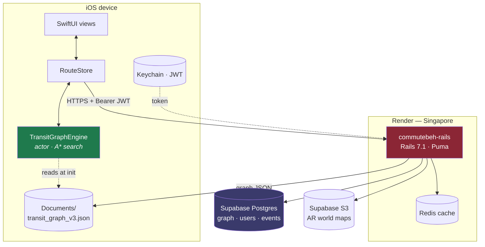
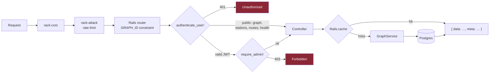
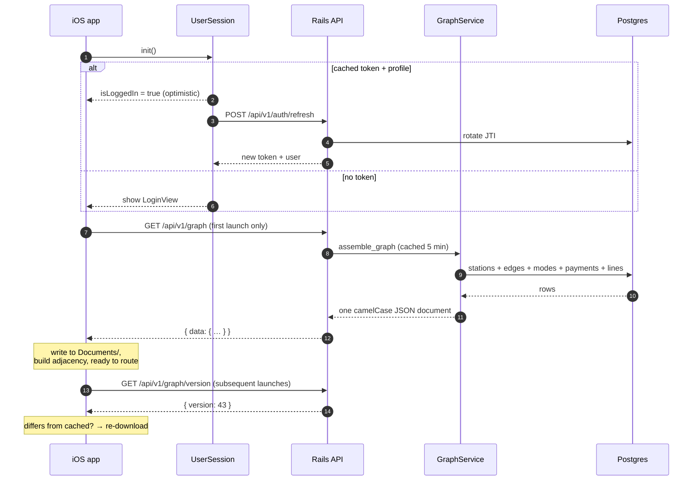
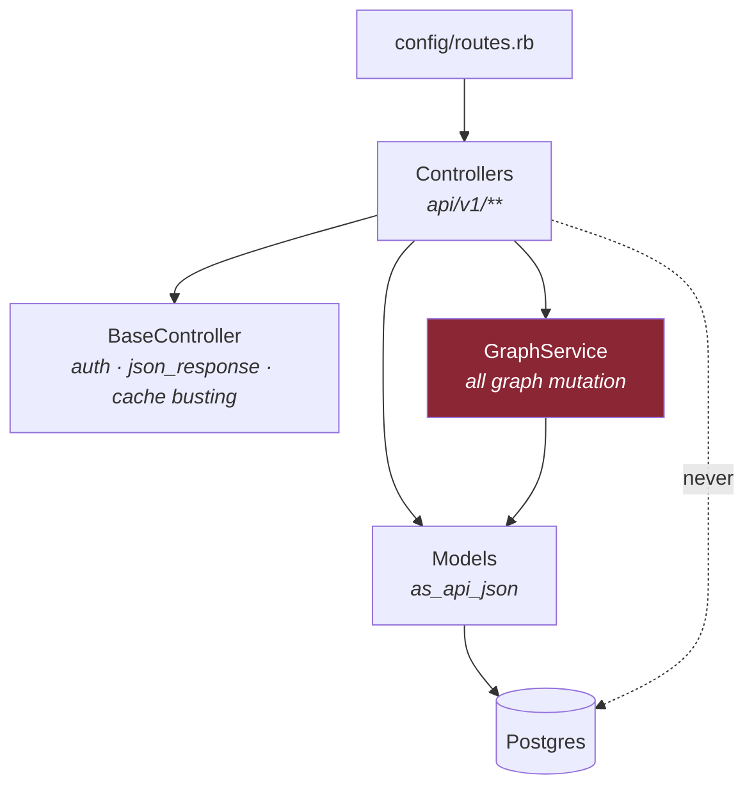

# Architecture
{: .no_toc }

1. TOC
{:toc}

---

## System context



Two things to internalise:

1. **Routing is entirely client-side.** The server never computes a path.
2. **The graph is not bundled with the app.** The only copy on a device is the one downloaded
   from `GET /api/v1/graph`. There is no bundle fallback — a first launch with no network cannot
   route at all.

## Request pipeline



### The `GRAPH_ID` router constraint

Graph IDs are author-supplied and can contain dots — the line `STACRUZ.LRT_BUENDIA`, for
instance. Rails' default dynamic segment stops at a dot and hands the rest to `:format`, so

```
DELETE /admin/graph/routes/STACRUZ.LRT_BUENDIA
```

arrived as `line_id: "STACRUZ"`, `format: "LRT_BUENDIA"` — **deleting nothing while still
reporting success**. Every route carrying a graph ID now uses

```ruby
GRAPH_ID = /[^\/]+/
# …
get "stations/:id", to: "stations#show",
    constraints: { id: GRAPH_ID }, format: false
```

If you add a route whose path carries a station, edge or line ID, it needs both the constraint
and `format: false`. `config/routes.rb:15`.

## Cold start, end to end



Note the optimistic login: the client shows its cached profile immediately and refreshes behind
it. A 401 on refresh forces a sign-out.

## Layering



**Controllers never mutate graph tables directly.** Every write goes through `GraphService`, which
owns the transaction boundary and the version bump. A controller that writes a station row itself
will produce a graph the clients never learn about, because nothing bumped the version.

The one sanctioned exception is `EdgesController#update`, which mutates a single edge and then
calls `GraphService.bump_version!` explicitly — a public class method that exists for exactly this
case.

## Concurrency and background work

| Concern | Mechanism |
|:--|:--|
| Web | Puma, `config/puma.rb` |
| Background jobs | Sidekiq, `worker` process in the `Procfile` |
| Cache | `Rails.cache` → Redis via `REDIS_URL` |
| Rate limiting | rack-attack |

Redis is treated as **optional**. `bust_graph_cache!` rescues every error, so an unset or
unreachable `REDIS_URL` degrades to "cache entries expire on their TTL" rather than failing
requests. See [Backend Internals → Caching]({{ site.baseurl }}/backend#caching).
