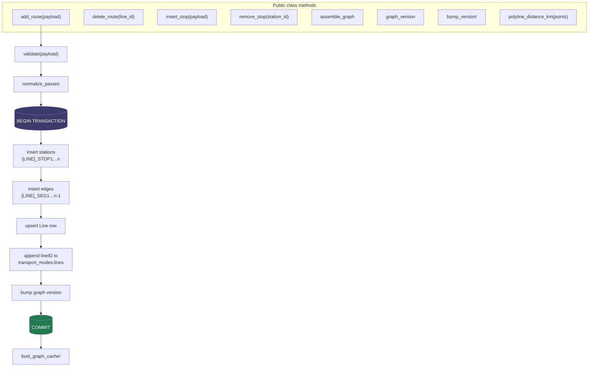
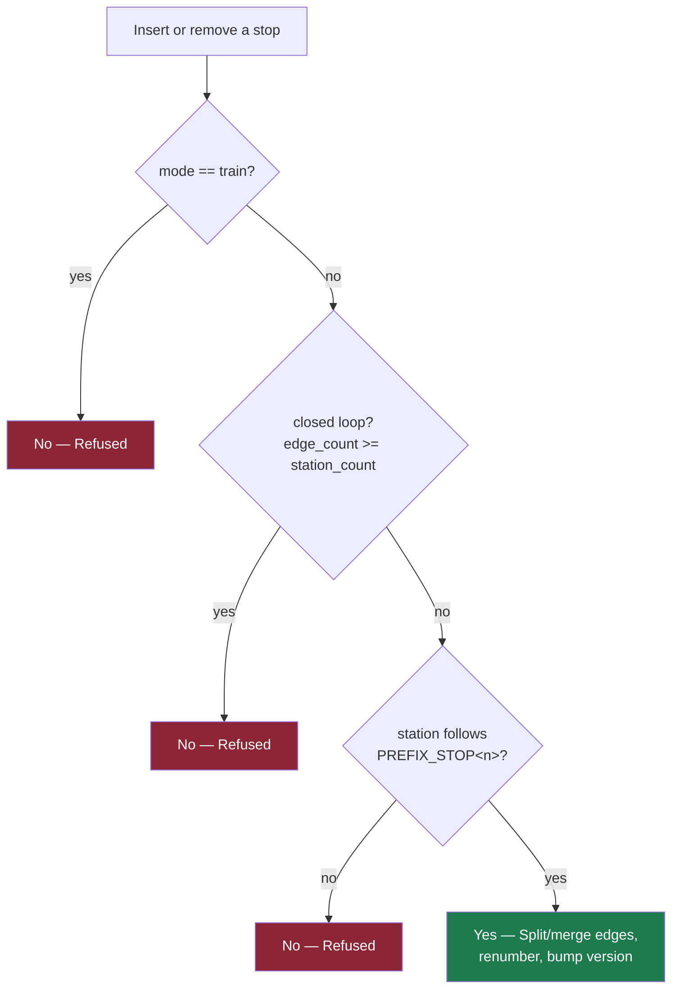
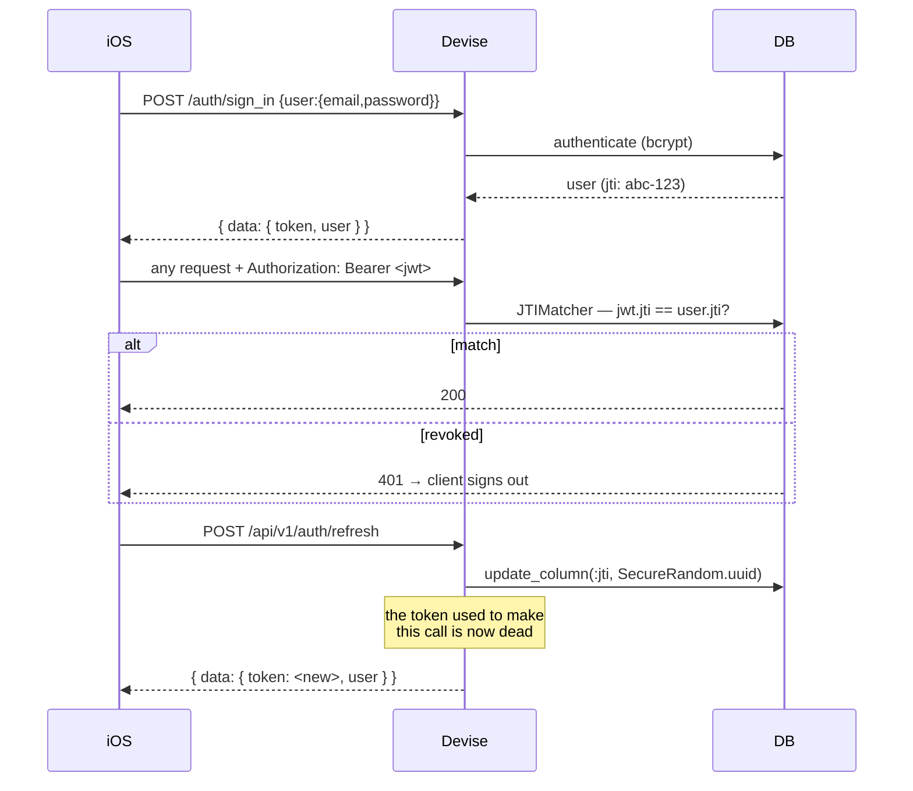

# Backend Internals
{: .no_toc }

1. TOC
{:toc}

---

## Stack

| Concern | Choice |
|:--|:--|
| Language / framework | Ruby 3.4 · Rails 7.1, `--api` mode |
| Server | Puma |
| Database | Postgres (Supabase), `pg_trgm` for fuzzy station search |
| Auth | Devise + devise-jwt, JTIMatcher revocation |
| Cache | Redis via `Rails.cache` |
| Jobs | Sidekiq (`worker` in the Procfile) |
| Rate limiting | rack-attack |
| CORS | rack-cors, origins from `ALLOWED_ORIGINS` |
| Object storage | Active Storage → Supabase S3-compatible |
| Serialization | hand-rolled `as_api_json` on models + `GraphService` |
| Tests | RSpec request + service specs |

## Layout

```
app/
├── controllers/
│   ├── health_controller.rb
│   └── api/v1/
│       ├── base_controller.rb        auth · json_response · error_response · cache busting
│       ├── graph_controller.rb       GET /graph, /graph/version   (public)
│       ├── stations_controller.rb    GET /stations, /stations/:id (public)
│       ├── routes_controller.rb      GET /routes, /routes/:line_id (public)
│       ├── saved_routes_controller.rb
│       ├── incidents_controller.rb
│       ├── analytics_controller.rb
│       ├── users_controller.rb
│       ├── ar_world_maps_controller.rb
│       ├── auth/{sessions,registrations}_controller.rb
│       └── admin/
│           ├── graph_controller.rb    create_route / delete_route
│           ├── stations_controller.rb create / update / destroy
│           ├── edges_controller.rb    geometry + directionality
│           ├── settings_controller.rb enforce_operating_hours
│           └── analytics_controller.rb summary / hotspots
├── models/                            15 models
└── services/
    └── graph_service.rb               Note: 1141 lines — all graph mutation logic
```

## `GraphService`

Every graph mutation goes through it, wrapped in a transaction, and every mutation bumps
`graph_meta.version`.



### `assemble_graph`

Builds the client-facing document. Two details matter:

- `Station.includes(:access_points)` — without the preload this is one query per station on a
  payload that already assembles the whole graph in one request.
- Output keys are **camelCase**, unlike every other endpoint.

### Validation

`LINE_ID_RE` permits uppercase letters, digits, underscores and dots — e.g.
`STACRUZ.LRT_BUENDIA`. Errors come back as a `{ field:, message: }` array.

| Check | Message |
|:--|:--|
| `displayName` blank | "Display name is required."|
| `lineID` blank | "Line ID is required."|
| `lineID` contains a space | "Line ID must not contain spaces."|
| `lineID` fails `LINE_ID_RE` | "Line ID must only contain uppercase letters, digits, underscores, and dots."|
| `lineID` already has stations | *conditional* — see below |
| `mode` not in `transport_modes` | invalid mode |
| fewer than 2 stops | at least 2 required |
| `crowdFactor` / `reliability` outside 0–1 | range error |

An existing `lineID` is **not** an automatic rejection: it is also the path for adding the missing
northbound/southbound direction to a route that already has the other one.
`existing_line_append_error` decides which case it actually is.

### Multi-pass payloads

`normalize_passes` accepts both the legacy flat `stops:` array and the multi-pass shape used by
the iOS Loop Creator:

```jsonc
{
  "passes": [
    { "direction": "northbound", "stops": [… ], "closesLoop": false },
    { "direction": "southbound", "stops": [… ], "closesLoop": true,
      "closingPolyline": [{ "lat": …, "lng": … } ] }
  ]
}
```

### `insert_stop` / `remove_stop` — deliberately narrow

These renumber a line's `_STOP<n>` / `_SEG<n>` chain, which is only well-defined under strict
conditions.



| Rule | Why |
|:--|:--|
| Never on `mode == "train"` | MRT/LRT stations are shared by both directions' edges. Splitting one direction's edge leaves the other silently bypassing the change — an asymmetric graph. |
| Never on a closed loop | The closing edge is real recorded geometry between two specific endpoints; if a terminal shifts there is no principled way to auto-repair it. |
| Only `<prefix>_STOP<n>` stations | That convention is what makes sequential renumbering well-defined. Hand-authored named stations (trains) don't use it and are excluded by rule 1 anyway. |

**Accepted tradeoff:** renumbering touches `stations` and `edges` only. It does not chase
station/edge IDs held as strings in `saved_routes`, `route_plan_events`, `ar_world_maps` or
`incidents` — there is no DB-level FK, so a renumbered ID can leave those dangling. Renumbering
was chosen over stable IDs (`graph_service.rb:344`).

The two service specs — `spec/services/graph_service_stop_editing_spec.rb` and
`graph_service_insert_stop_polyline_spec.rb` — encode these rules and are the first thing to read
before touching this code.

## Auth



Revocation is **JTIMatcher** — one live token per user. Refresh rotates the JTI, so the previous
token dies immediately.

`update_column` writes through to the in-memory attribute, so the `UserEncoder.call` on the next
line signs the **new** JTI. A detail that would silently mint dead tokens if it didn't.

Public endpoints call `skip_before_action :authenticate_user!` — currently `graph`, `stations`,
`routes` and `health`.

## Caching

| Key | TTL | Busted by |
|:--|:--|:--|
| `full_graph` | 5 min | `bust_graph_cache!` on any admin write |
| `graph_version` | 30 s | same |
| `routes_index` | 30 min | pattern bust |
| `stations/<line>/<type>/<interchange>/<search>` | 1 hour | pattern bust |

`bust_graph_cache!` (`base_controller.rb:40`) rescues everything and logs:

```ruby
def bust_graph_cache!(extra_pattern: nil)
  Rails.cache.delete_matched(extra_pattern) if extra_pattern
  Rails.cache.delete("full_graph")
  Rails.cache.delete("graph_version")
rescue => e
  Rails.logger.error("[cache] bust_graph_cache! failed: #{e.class}: #{e.message}")
end
```

This is a fix for a live bug. Every admin write called `Rails.cache.delete` unprotected *after*
the DB transaction had already committed, so a Redis blip surfaced as a raw 500 to the client even
though the write had succeeded. Worst case now is briefly stale cache until the TTL expires —
much better than a false failure.

## Deployment

`render.yaml`:

```yaml
type: web · runtime: ruby · region: singapore · plan: starter
buildCommand:     bundle install
preDeployCommand: bundle exec rails db:migrate
startCommand:     bundle exec puma -C config/puma.rb
healthCheckPath:  /health
```

Environment: `DATABASE_URL`, `SECRET_KEY_BASE` (generated), `DEVISE_JWT_SECRET_KEY`, `REDIS_URL`,
`ALLOWED_ORIGINS`, `SUPABASE_S3_*`, `SUPABASE_STORAGE_BUCKET`,
`RAILS_SKIP_ASSET_COMPILATION=true`.

{: .warning }
> **Seeds never run on deploy.** The pipeline runs `db:migrate` only. Anything the app requires to
> *function* must live in a migration, not `seeds.rb`. Production shipped with an empty
> `graph_meta` and no admin user until migration 011 fixed it.

{: .note }
> **The `starter` plan spins down on idle** — a cold request takes roughly 44 seconds. First
> launch after a quiet period looks like a hang. Worth remembering before debugging a "network
> bug" that is just a cold dyno.

## Local development

```bash
bundle install
bin/rails db:create db:migrate
bin/rails server                 # → http://localhost:3000

bundle exec rspec
bundle exec rubocop
```

`.env` (via `dotenv-rails`, development/test only):

```
DATABASE_URL=postgres://localhost/commutebeh_development
DEVISE_JWT_SECRET_KEY=<any long random string>
REDIS_URL=redis://localhost:6379/0     # optional — cache degrades gracefully
ALLOWED_ORIGINS=http://localhost:3000
```

To point the iOS client at a local server, swap the commented line in
`Gora/Networking/APIConfig.swift`.

## Migration history

Read this as a changelog of the data model.

| # | What it did |
|:--|:--|
| 001–008 | extensions, users, saved routes, AR maps, route plan events, incidents, Active Storage, trigram search indexes |
| 009 | **graph tables** — `graph_meta`, `transport_modes`, `payment_methods`, `peak_hour_config`, `fare_matrix`, `stations`, `edges` |
| 010, 012 | `enforce_operating_hours` on `graph_meta` |
| 011 | bootstrap admin user + `GraphMeta` row |
| 013, 015 | `is_road_snapped` on edges + backfill for dense polylines |
| 014 | real primary keys on graph tables |
| 016 | corrected rail station coordinates |
| 017 | `station_access_points` (station doors) |
| 018, 019 | `lines` table + version bump so clients re-sync |

Doors and named lines are recent additions, which is why the client decodes both defensively.

## Known gaps

| Item | Detail |
|:--|:--|
| `places` / `events` routes | Declared at `config/routes.rb:58` with **no controllers**. Requests raise rather than 404. |
| `graph_service.rb` size | 1141 lines holding all mutation logic. Splitting by operation is the obvious refactor. |
| Root `README.md` / `CLAUDE.md` | Describe a Hono proxy at `:3001` that does not exist. |
| Orphaned IDs | Stop renumbering can dangle `saved_routes` / `route_plan_events` references — see above. |
