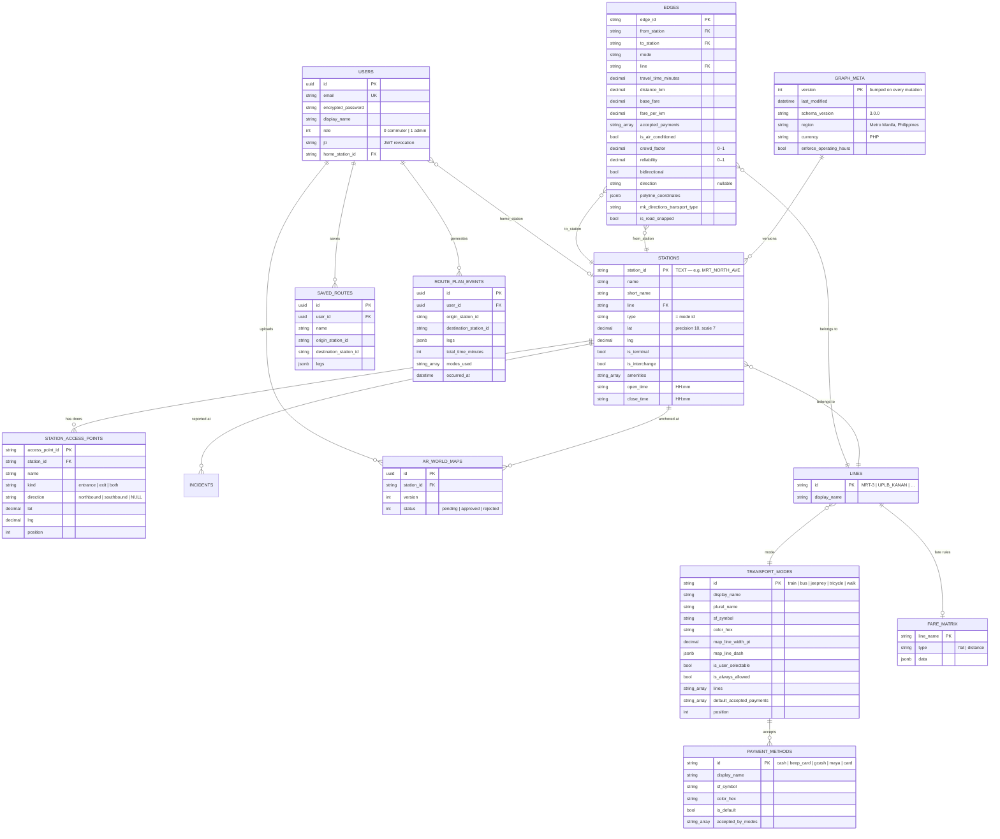

# Data Model
{: .no_toc }

1. TOC
{:toc}

---

The transit graph exists in two representations that must stay in lockstep:

- **Postgres**, normalised — the authoring source of truth.
- **JSON**, denormalised — one document assembled by `GraphService.assemble_graph`, served by
  `GET /api/v1/graph`, cached on device.

## Entity relationships



## TEXT primary keys

`stations`, `edges`, `station_access_points`, `transport_modes`, `payment_methods`, `lines` and
`fare_matrix` all use **author-supplied TEXT primary keys**, not surrogate integers. The ID is
part of the data contract with the client and appears in URLs, saved routes and analytics rows.

Consequences:

- Models declare `self.primary_key` explicitly — `app/models/station.rb:2`.
- `Station` and `Edge` set `self.inheritance_column = nil`, because both have a real `type` column
  that has nothing to do with STI. Forgetting this raises `SubclassNotFound` — it has already
  broken a migration once (`0c708ca`).
- IDs can contain dots, hence the `GRAPH_ID` router constraint.

{: .warning }
> There is **no DB-level FK** from `saved_routes`, `route_plan_events`, `ar_world_maps` or
> `incidents` to a station ID. Stop renumbering can therefore orphan those references — an
> accepted tradeoff documented at `app/services/graph_service.rb:344`.

## The JSON document

`GET /api/v1/graph` returns this shape, assembled at `app/services/graph_service.rb:626`:

```jsonc
{
  "version": 42,
  "lastModified": "2026-08-10T09:12:33Z",
  "enforceOperatingHours": true,
  "metadata": {
    "region": "Metro Manila, Philippines",
    "currency": "PHP",
    "schemaVersion": "3.0.0",
    "polylineNote": "polylineCoordinates define the static display shape of each edge…"
  },
  "transportModes": { "train": { … }, "walk": { … } },
  "paymentMethods": { "cash": { … } },
  "lines":          { "MRT-3": { "id": "MRT-3", "displayName": "MRT-3" } },
  "peakHourMultipliers": {
    "morningPeak": { "startHour": 6, "endHour": 9, "multiplier": 1.4,
                     "appliesTo": ["bus", "jeepney"] },
    "eveningPeak": { … },
    "trainPeak":   { … }
  },
  "fareMatrix": { "MRT-3": { … } },
  "stations": [ … ],
  "edges":    [ … ]
}
```

### Case conventions — read carefully

| Surface | Case | Serialiser |
|:--|:--|:--|
| The graph document | **camelCase** | `GraphService#station_json` / `#edge_json` |
| Every other endpoint | **snake_case** | `Model#as_api_json` |

Both are live simultaneously. The client decodes the graph with a plain `JSONDecoder` and
everything else with `.convertFromSnakeCase`. Check which side of the line you're on before
adding a field.

{: .important }
> A field must be added to **both** serialisers or it silently vanishes on OTA sync. This has
> already happened: `interchangesWith` exists in the iOS `Station` model and in the original
> bundled graph but is emitted by neither serialiser, so every sync nils it out and the client
> patches around it. The comment at `app/models/station.rb:31` exists to stop access points
> repeating that mistake.

### Client decoding tolerances

The client is deliberately forgiving, because a cached graph on a user's device may predate a
schema addition:

| Field | Tolerance | Reason |
|:--|:--|:--|
| `version` | `Int` **or** `String` | Server emits Int; the client's local re-encode emits String |
| `lines` | missing → `{}` | Added after the first shipped graphs |
| `enforceOperatingHours` | missing → `true` | Backwards-compatible default |

Add new graph fields the same way. See
[Graph Sync → Schema evolution]({{ site.baseurl }}/graph-sync#schema-evolution-rules).

## Invariants

These hold across both tiers. Breaking one produces subtle, hard-to-trace bugs.

1. **No hardcoded transit data.** Station names, fares, coordinates, mode strings and payment
   strings all come from the graph.
2. **`walk` is not special-cased by name.** The client derives its always-allowed mode set from
   `is_always_allowed = true` in `transport_modes`.
3. **A stitched leg's polyline drops the first coordinate of each subsequent segment** — it
   duplicates the shared junction point.
4. **Fare is computed once per leg** (single boarding), never summed per edge — that is what makes
   distance-bracketed rail fares come out right.
5. **`is_terminal` is assigned server-side** from stop index, never trusted from a client.
6. **Reverse edges are synthetic.** A `bidirectional` edge is one stored row; the client
   synthesises the reverse at load time with the polyline reversed and the direction label flipped
   (`northbound` ⇄ `southbound`). Never store both directions of a bidirectional edge.
7. **A polyline starts at `edge.from` and ends at `edge.to`.** The Polyline Recorder reverses
   recorded points when a rider crosses a bidirectional edge "backwards" specifically to preserve
   this.
