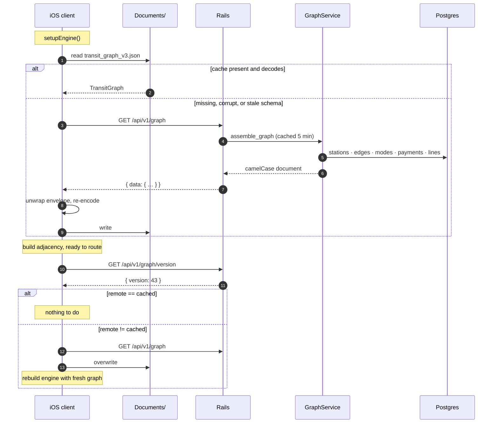
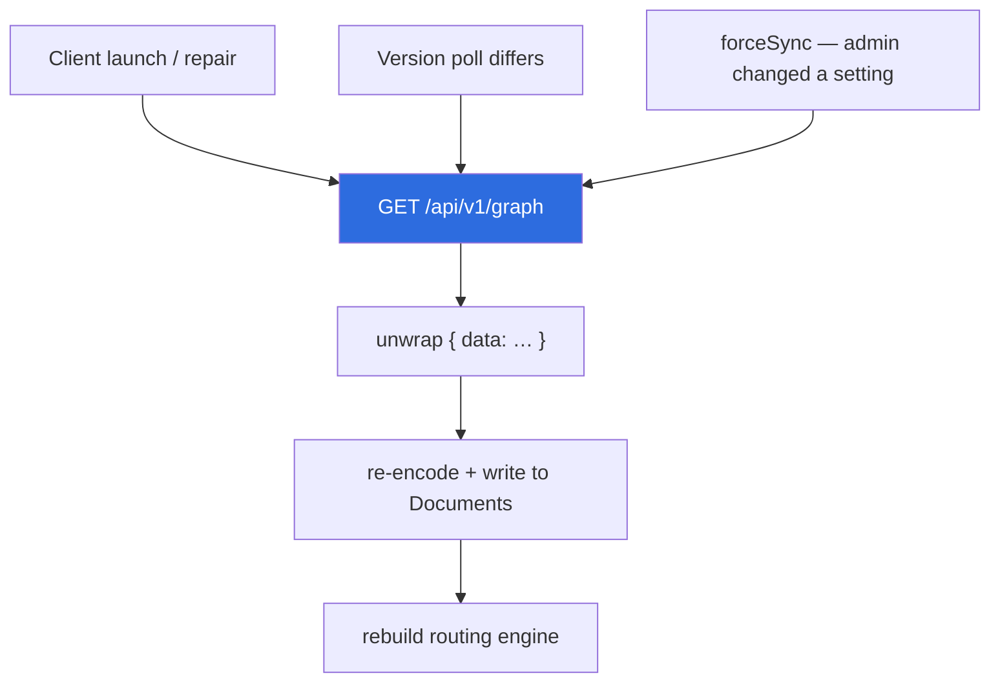

# Graph Sync
{: .no_toc }

1. TOC
{:toc}

---

The transit graph is **not bundled with the iOS app**. The only copy on a device is downloaded
from this service and cached in the app's `Documents/` directory. That is what lets an admin add a
jeepney route and have every user routing over it without an App Store release.

It also means a first launch with no network cannot route at all, and a cache that fails to decode
has no bundle to fall back to. Both constraints land on this service's contract.

## Lifecycle

## Version semantics

`graph_meta.version` is an integer bumped on **every** mutation. The client compares it as a
String, and the comparison is `!=`, not `<` — so a rollback on the server (version going *down*)
still triggers a re-download, which is the desired behaviour.

`forceSync` exists for the case where an admin toggles `enforce_operating_hours`: the server bumps
the version, but the app shouldn't wait for the next natural poll to reflect a setting the admin
just changed.

{: .warning }
> **The envelope matters.** The client unwraps `{ "data": … }` and re-encodes the inner value
> before writing to disk. Writing the raw response body instead would store the envelope, and the
> loader — which has no bundle fallback — would fail to decode it on every subsequent launch. Any
> change to the response envelope on `GET /api/v1/graph` is a breaking change.

## What bumps the version

| Action | Bumps | Busts cache |
|:--|:--|:--|
| `POST /admin/graph/routes` | ✅ | ✅ |
| `DELETE /admin/graph/routes/:line_id` | ✅ | ✅ |
| `POST /admin/stations` (insert stop) | ✅ | ✅ |
| `PATCH /admin/stations/:id` | ✅ | ✅ |
| `DELETE /admin/stations/:id` | ✅ | ✅ |
| `PATCH /admin/edges/:id` | ✅ via `bump_version!` | ✅ |
| `PATCH /admin/settings` | ✅ | ✅ |

Anything that changes what `assemble_graph` would emit **must** bump the version. A mutation that
doesn't is invisible to every already-installed client until a cache TTL happens to expire and
something else forces a re-download — which may be never.

## Server cache TTLs

| Key | TTL |
|:--|:--|
| `graph_version` | 30 s |
| `full_graph` | 5 min |

Admin writes call `bust_graph_cache!`, so an authored change is visible immediately rather than
after the TTL. If a Redis blip swallows the bust, the TTL is the backstop — see
[Backend Internals → Caching]({{ site.baseurl }}/backend#caching).

## Schema evolution rules

Because a cached graph on a user's device may predate any change you make:

1. **New fields must be optional client-side.** The client uses `decodeIfPresent` with a safe
   default, the way `lines` (→ `{}`) and `enforceOperatingHours` (→ `true`) do. Coordinate the
   client change *before* the server starts emitting a field that the client requires.
2. **A required field added carelessly bricks every cached graph in the field.** The old cache
   fails to decode; the client treats that as repairable and re-downloads — so the failure mode is
   recoverable *if the user has network*, and a hard stop if they don't.
3. **Bump the graph version when you change the emitted shape**, so clients pull the new document
   instead of waiting for a TTL. Migration 019 exists purely to do that after the `lines` table
   landed.
4. **Add the field to both serialisers.** `as_api_json` (snake_case) *and* `GraphService#*_json`
   (camelCase). Omitting the second means the field silently vanishes on every OTA sync — this has
   already happened with `interchangesWith`.

## Failure handling on the client

Sync never throws to the caller. Every failure records a distinct reason —
`"version check failed: …"`, `"download failed: …"`, `"cache write failed: …"` — and the app keeps
routing on whatever graph it already has.

The rationale is worth understanding from this side of the wire: **a stale graph is
indistinguishable from a genuine routing failure.** A user reporting "no route found" for a trip
you know the graph covers may simply be on an old version. The recorded reason is what makes the
two tellable apart, and it is surfaced on the admin screen.

So when a bug report says routing is broken, check the client's graph version against
`GET /api/v1/graph/version` before investigating the engine.
