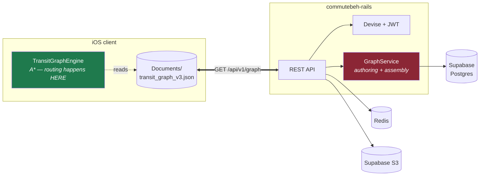
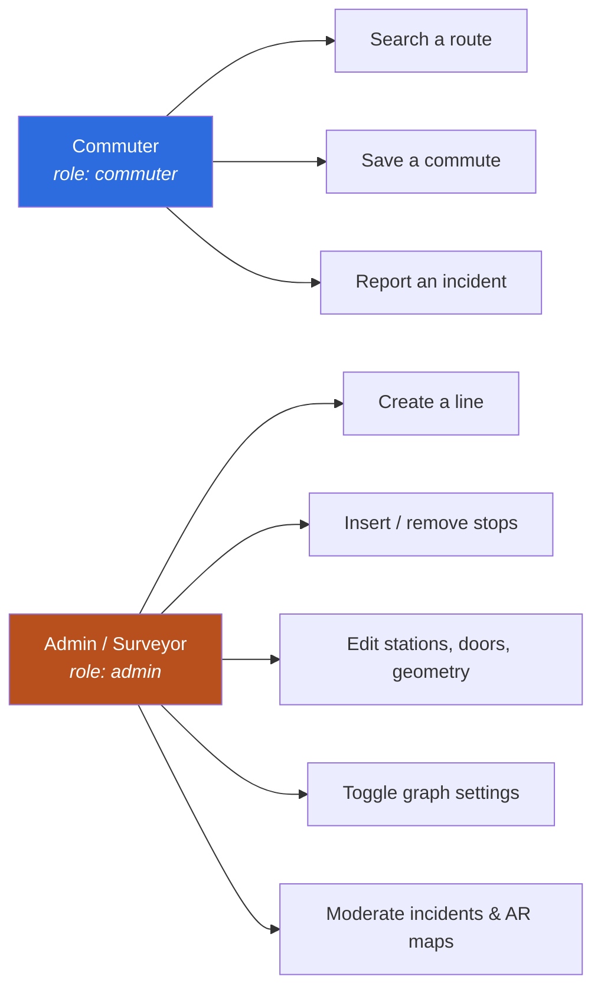

# Overview
{: .no_toc }

1. TOC
{:toc}

---

## What the system does

A commuter opens Gora, types where they are and where they want to go, and gets two or three
ranked door-to-door itineraries: walk 300 m to the jeepney stop, ride to Crossing, transfer to
MRT-3, ride to Ayala, walk 450 m to the office. Each carries a fare in pesos, a duration adjusted
for peak hours, and a map polyline following real road and pedestrian geometry.

What separates it from a generic map app is the data. Metro Manila's jeepney and tricycle network
is in no public feed. Gora carries its own transit graph — and this service is where that graph is
authored, versioned and served from.

## Where this service sits

The client downloads the graph once, caches it, and routes locally. The server never sees a
routing request.

## Who uses it

Role is the `users.role` enum — `commuter: 0`, `admin: 1`. `require_admin!` in `BaseController`
gates the entire `/api/v1/admin` namespace with a 403.

## Glossary

| Term | Meaning |
|:--|:--|
| **Station** | A node in the graph. Not necessarily a rail station — a jeepney stop is a station. TEXT primary key, e.g. `MRT_NORTH_AVE`, `UPLB_KANAN_STOP3`. |
| **Edge** | A directed ride between two stations on one line. May be `bidirectional`, in which case the client synthesises the reverse at load time. |
| **Line** | A named service — `MRT-3`, `EDSA_BUS`, `UPLB_KANAN`. Groups stations and edges. |
| **Mode** | `train`, `bus`, `jeepney`, `tricycle`, `walk`. Defined as data in `transport_modes`, never hardcoded. |
| **Access point / door** | A specific entrance or exit of a station, with its own coordinates, so walks are measured to the door a passenger actually uses. |
| **Graph version** | Integer on `graph_meta`, bumped on every mutation. Drives the client's OTA sync. |
| **Pass** | One direction of a recorded route. A two-pass submission becomes northbound + southbound edge sets on one `lineID`. |

## Reserved line identifiers

Two line values are control flags rather than real services. Both matter to the server because
they change how the client treats an edge:

| Value | Meaning | Client behaviour |
|:--|:--|:--|
| `INTERCHANGE` | A recorded transfer walk between two stations | Never merged into a ride leg; skips fare and operating-hours checks |
| `ACCESS_WALK` | Synthetic walk from a coordinate endpoint to a stop | Generated at search time on device, **never stored server-side** |

## Naming note

The product is **Gora**, and the iOS project, target and bundle ID (`com.banaueinc.gora`) now
all match it.

The old name **CommuteBeh** survives on the server side: this repository is `Commute-Backend`,
its app directory is `commutebeh-rails`, and the bootstrap admin account is
`admin@commutebeh.ph`. Expect the old name in infrastructure, not in the client.
